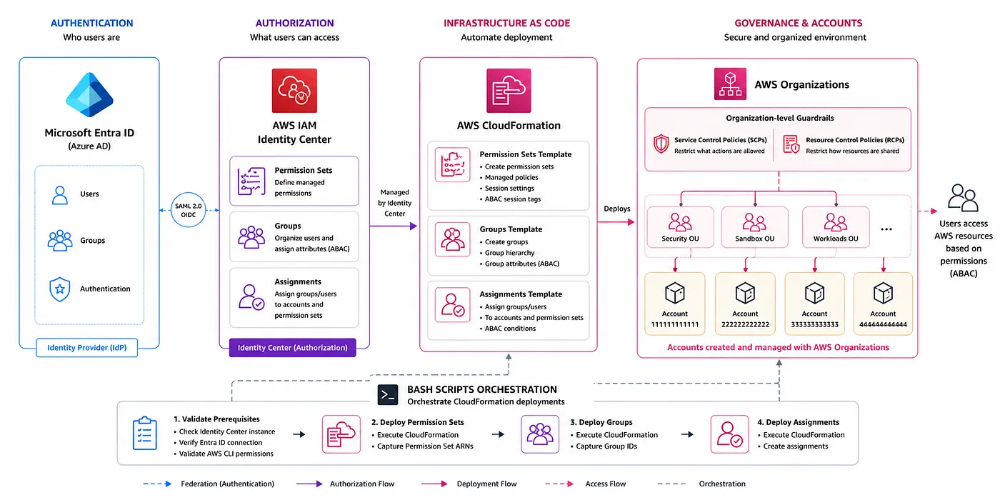

# Identity

Manages IAM Identity Center configuration for the platform:
Permission Sets, group-based access control, and account assignments.
Built on top of the Identity Center baseline created by Control Tower.



See the main [README](../README.md) for project overview.

## Scope

- **Identity-enhanced sessions**: injects `email` from the Entra ID SAML assertion into every SSO session context — required for ABAC policies
- **Permission Sets**: `AcmePlatformAdmin`, `AcmeDeveloperAccess`, `AcmeReadOnlyAccess`
- **Groups**: `Acme-Infrastructure-Admins`, `Acme-Platform-Admins`, `Acme-Developers`, `Acme-Operations`
- **Account assignments**: group → Permission Set → AWS account (6 assignments)
- **Group memberships**: user → group (managed via CLI, not CloudFormation)

This domain does **not** modify any resources created by Control Tower
(`AWSControlTower*` groups, `AWSAdministratorAccess` Permission Set, or
Account Factory assignments).

## Prerequisites

Before running any script in this domain:

1. **Organizations domain deployed** — the `acme-accounts` stack must exist and
   export `NetworkAccountId`, `SharedServicesAccountId`, `DevAccountId`, and
   `ProdAccountId`.
2. **Entra ID configured as external IdP** — this is a manual step completed
   once before running these scripts. See the Entra ID integration notes in
   `.kiro/steering/project-context.md`.
3. **SSO users exist in Identity Center** — created automatically by Account
   Factory when accounts were provisioned (one user per account).

## Access Design

### Permission Sets

| Permission Set | Base Policy | Session | Purpose |
|---|---|---|---|
| `AcmePlatformAdmin` | `AdministratorAccess` (AWS managed) | 8h | Full access for infra/platform engineers |
| `AcmeDeveloperAccess` | Custom inline policy | 8h | Platform services — no IAM, no billing |
| `AcmeReadOnlyAccess` | `ReadOnlyAccess` (AWS managed) | 4h | Audit and cross-environment observability |

### Groups and Assignments

| Group | Member | Permission Set | Account |
|---|---|---|---|
| `Acme-Infrastructure-Admins` | infrastructure engineer | `AcmePlatformAdmin` | Network |
| `Acme-Platform-Admins` | platform engineer | `AcmePlatformAdmin` | Shared Services |
| `Acme-Developers` | developer | `AcmeDeveloperAccess` | Dev |
| `Acme-Developers` | developer | `AcmeReadOnlyAccess` | Prod |
| `Acme-Operations` | operations engineer | `AcmePlatformAdmin` | Prod |
| `Acme-Operations` | operations engineer | `AcmeReadOnlyAccess` | Dev |

## Usage

Run from the project root:

```bash
./start.sh
# Select: 3) Identity
```

Or run directly from the domain directory:

```bash
cd identity
./start.sh
```

Options:

- **1) Create** — deploys Permission Sets, groups, assignments, and group memberships from scratch.
- **2) Update** — re-deploys the three CloudFormation stacks to apply template changes. Does not modify group memberships.
- **3) Delete** — removes all Identity domain resources in reverse order after explicit confirmation.

## Configuring AWS CLI Profiles (SSO)

Each user authenticates via Entra ID (SAML) and accesses their assigned AWS
accounts through Identity Center. Configure the following profiles in
`~/.aws/config`. Each user needs one profile per account they have access to:

```ini
[sso-session your-org]
sso_start_url = https://<your-instance-id>.awsapps.com/start
sso_region    = us-east-1
sso_registration_scopes = sso:account:access

# Example: developer with full access in Dev and read-only in Prod
[profile developer-dev]
sso_session    = your-org
sso_account_id = <dev-account-id>
sso_role_name  = AcmeDeveloperAccess
region         = us-east-1

[profile developer-prod]
sso_session    = your-org
sso_account_id = <prod-account-id>
sso_role_name  = AcmeReadOnlyAccess
region         = us-east-1
```

To authenticate, run:

```bash
aws sso login --sso-session your-org
```

This opens the browser, authenticates via your external IdP (MFA included),
and stores temporary credentials locally. Credentials are valid for the
session duration defined in the Permission Set
(8h for `AcmePlatformAdmin` and `AcmeDeveloperAccess`, 4h for `AcmeReadOnlyAccess`).

> **Note**: Use the IPv4-only `sso_start_url` format
> (`<instance-id>.awsapps.com/start`). The Dual-stack endpoint
> (`ssoins-*.portal.us-east-1.app.aws`) causes browser redirect failures with
> error `AADSTS50011` when using Entra ID. If the browser redirect fails,
> use the device code flow as a fallback:
> ```bash
> aws sso login --sso-session your-org --use-device-code
> ```

### Optional: shell shortcut for SSO login

To avoid typing the full login command each time, add this function to your
`~/.zshrc` (or `~/.bashrc`):

```bash
# SSO login — clears cache and authenticates
sso-login() {
  find ~/.aws/sso/cache -type f -delete 2>/dev/null
  aws sso login --sso-session your-org
}

# SSO logout — revokes credentials and clears local cache
sso-logout() {
  aws sso logout
  find ~/.aws/sso/cache -type f -delete 2>/dev/null
  echo "Logged out from SSO session."
}
```

Then reload your shell and use `sso-login` and `sso-logout` to manage your SSO session. All profiles sharing the same `sso-session` will be refreshed with a single login.

## Structure

```
identity/
├── start.sh
├── common/
│   └── resolve-instance.sh    # Resolves Identity Center ARN and Identity Store ID
├── scripts/
│   ├── create.sh              # Deploy all domain resources (Steps 1-8)
│   ├── update.sh              # Re-deploy and apply changes (Steps 1-5)
│   ├── delete.sh              # Remove all domain resources (Steps 1-6)
│   └── enable-scim.sh         # Enable automatic provisioning from Entra ID
└── cloudformation/
    ├── 1-permission-sets.yaml # AcmePlatformAdmin, AcmeDeveloperAccess, AcmeReadOnlyAccess
    ├── 2-groups.yaml          # Acme-* groups
    └── 3-assignments.yaml     # 6 group → Permission Set → account assignments
```

## Access Verification

Use these commands to verify that each user can access what they should —
and cannot access what they should not.

### Platform admin role

```bash
# Must succeed — full admin access
aws ec2 describe-vpcs --profile <admin-profile>
aws iam list-users --profile <admin-profile>
```

### Developer role — full access in Dev, read-only in Prod

```bash
# Must succeed — DeveloperAccess includes Lambda and DynamoDB
aws lambda list-functions --profile <developer-dev-profile>
aws dynamodb list-tables --profile <developer-dev-profile>

# Must fail with AccessDenied — IAM is denied by DeveloperAccess policy
aws iam list-users --profile <developer-dev-profile>

# Must succeed — ReadOnlyAccess allows describe operations in Prod
aws lambda list-functions --profile <developer-prod-profile>

# Must fail with AccessDenied — ReadOnly does not allow write operations
aws s3 mb s3://test-bucket --profile <developer-prod-profile>
```

### Operations role — full access in Prod, read-only in Dev

```bash
# Must succeed — full admin access in Prod
aws iam list-users --profile <operations-prod-profile>

# Must succeed — ReadOnlyAccess allows describe operations in Dev
aws lambda list-functions --profile <operations-dev-profile>

# Must fail with AccessDenied — ReadOnly does not allow write operations in Dev
aws s3 mb s3://test-bucket --profile <operations-dev-profile>
```

## Concepts

### The three-layer model of Identity Center

Identity Center organizes access control around three independent concepts
that answer three different questions:

```
What can you do?    → Permission Sets  (1-permission-sets.yaml)
Who are you?        → Groups           (2-groups.yaml)
Where can you go?   → Assignments      (3-assignments.yaml)
```

This separation is intentional — each layer can evolve independently.

### Permission Sets

A Permission Set is a **portable IAM role definition**. It describes what
actions a user can perform when they access an AWS account via SSO.

When a user logs in and selects an account, Identity Center creates a
temporary role in that account with exactly the permissions defined in the
Permission Set. That role exists only for the duration of the session (8h
or 4h) and is automatically revoked when it expires.

Permission Sets can attach AWS managed policies (e.g. `AdministratorAccess`,
`ReadOnlyAccess`) or define custom inline policies for fine-grained control.
This domain uses both: managed policies for admin and read-only access, and
a custom inline policy for developers that restricts access to platform
services and enforces ABAC.

### Groups

A Group in Identity Center is a **container of users** that share the same
functional role in the organization. Groups have no permissions on their own —
they are just a way to apply access in bulk instead of per user.

In this domain, groups map directly to teams in the organization:
`Acme-Infrastructure-Admins`, `Acme-Platform-Admins`, `Acme-Developers`, and
`Acme-Operations`. Adding a new team member to a group automatically grants
them all the access assignments that group has.

**Note**: without SCIM (requires Entra ID P1), group membership is managed
directly in Identity Center via scripts. Entra ID is responsible only for
authentication (verifying who the user is via SAML). Identity Center is
responsible for authorization (what the user can access).

### Assignments

An Assignment is the **link** that connects a group, a Permission Set, and
a specific AWS account. It is the answer to: "who can enter where, with what
permissions?".

Each assignment has three components:

- **Principal** (group) — who gets access
- **Permission Set** — what they can do once inside
- **Target** (AWS account) — which account they can access

This domain defines six assignments that implement the cross-environment
access policy: developers have full access in Dev but
read-only in Prod; operations has full access in Prod but read-only in Dev.
This pattern prevents accidental production changes while maintaining full
observability across environments.

### Why three separate CloudFormation stacks

Separating the three layers into independent stacks has operational benefits:

- A policy change in `AcmeDeveloperAccess` only requires updating the
  Permission Sets stack — groups and assignments are not affected.
- Adding a new team only requires updating the groups stack.
- Onboarding a new AWS account only requires adding assignments — no
  changes to permissions or group structure.
- CloudFormation export dependencies between stacks prevent accidental
  deletion: you cannot delete the groups stack while the assignments stack
  still references it.

### ABAC — Attribute-Based Access Control

The `AcmeDeveloperAccess` Permission Set enforces ABAC using the `email` attribute
injected by identity-enhanced sessions. When using Entra ID as an external IdP,
the email comes from the SAML assertion (`${path:emails[primary eq true].value}`)
and is available in every session as `aws:PrincipalTag/email`.

- **Creating** a resource requires the request to include the tag
  `owner = <email>` — developers must tag their resources at creation time.
- **Modifying or deleting** an existing resource requires the resource to
  have the tag `owner = <email>` — developers can only modify resources
  they created.
- **Reading** any resource is unrestricted within allowed services —
  developers can observe the full environment for debugging.

This pattern scales naturally to the Workloads domain, where resource
isolation per team will be enforced at the infrastructure level.

### How SCPs and RCPs interact with Identity access

Identity Center controls **who can enter** an account and **what they can do**
once inside. But the Organizations domain adds two additional layers that
apply on top of Identity Center permissions — they cannot be overridden by
any Permission Set, no matter how permissive.

**Service Control Policies (SCPs)** restrict the maximum permissions available
in a member account. Even if `AcmePlatformAdmin` grants `AdministratorAccess`,
an SCP can still block specific actions. For example, the
`AcmeDenySecurityServiceModifications` SCP prevents anyone — including platform
admins — from disabling GuardDuty or deleting CloudTrail trails in the
Infrastructure and Workloads accounts.

**Resource Control Policies (RCPs)** restrict who can access resources,
regardless of what the resource's own policy says. The `AcmeIdentityPerimeter`
RCP ensures that S3 buckets, DynamoDB tables, SQS queues, and other core
services in member accounts can only be accessed by identities within this
organization. Even if a developer accidentally made an S3 bucket public, the
RCP would block any external access.

The evaluation order when a user makes an API call is:

```
1. RCP — does the resource allow this principal? (org boundary)
2. SCP — does the org allow this action? (identity boundary)
3. Permission Set — does the session allow this action?
4. Resource policy — does the resource itself allow it?
```

All four must allow the action for it to succeed. This creates a
**defense-in-depth** model where no single misconfiguration can open a
security gap.

### Defense-in-depth model

```
┌──────────────────────────────────────────────┐
│  Organizations layer (always enforced)       │
│  ┌─────────────────────────────────────────┐ │
│  │  SCP: restricts actions by identity     │ │
│  │  RCP: restricts access to resources     │ │
│  └─────────────────────────────────────────┘ │
│                                              │
│  Identity Center layer                       │
│  ┌─────────────────────────────────────────┐ │
│  │  Permission Set: defines session perms  │ │
│  │  ABAC: enforces resource ownership      │ │
│  └─────────────────────────────────────────┘ │
└──────────────────────────────────────────────┘
```

This layered approach means:
- A compromised SSO session is bounded by SCPs and RCPs.
- A misconfigured resource policy cannot expose data externally.
- A developer cannot escalate privileges beyond what the Permission Set allows.
- Even with full admin permissions, security services cannot be disabled.
