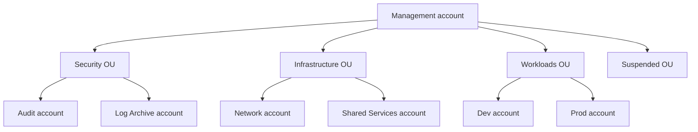

# Organizations

Automates AWS Organizations and Control Tower setup: Landing Zone, OUs,
accounts via Account Factory, guardrails, and Service Control Policies.



See the main [README](../README.md) for project overview.

## Scope

- **Landing Zone**: Control Tower LZ 4.0 with centralized logging and security roles
- **OUs**: Security, Infrastructure, Workloads, Suspended
- **Accounts**: Audit, Log Archive (via `AWS::Organizations::Account`); Network, Shared Services, Dev, Prod (via Account Factory)
- **Guardrails**: Region deny and root access key denial applied to Infrastructure and Workloads OUs
- **SCPs**: Complementary Service Control Policies that extend CT guardrails (GuardDuty, CloudTrail, IAM Access Analyzer, Security Hub, network controls, Identity Center protection)
- **RCPs**: Resource Control Policy implementing the identity data perimeter (S3, DynamoDB, SQS, Secrets Manager, KMS, ECR, CloudWatch Logs)

## Prerequisites

1. Copy `config/example.env` to `config/local.env` and complete every account
   and SSO user value. The local file is excluded from Git.
2. An AWS Organization must exist before running any script.
   ```bash
   aws organizations create-organization --feature-set ALL
   ```
3. Request a quota increase for "Maximum number of accounts" to at least 15 via Service Quotas before provisioning accounts.
4. Wait for the quota increase to be approved.

## Usage

Run from the project root:

```bash
./start.sh
# Select: 1) Organizations
```

Or run directly:

```bash
cd organizations
./start.sh
```

Options:

- **1) Create** — full setup: IAM roles, OUs, Landing Zone, accounts, guardrails, SCPs, RCPs.
- **2) Update** — re-deploys all stacks idempotently to apply template changes.
- **3) Delete** — tears down the Landing Zone and all managed resources after confirmation.

## Structure

```
organizations/
├── start.sh
├── scripts/
│   ├── create.sh              # Full setup (Steps 1-11)
│   ├── update.sh              # Re-deploy all stacks (Steps 1-7)
│   └── delete.sh              # Tear down
├── common/
│   └── register-and-enroll.sh # Register and enroll OUs in Control Tower
└── cloudformation/
    ├── 1-iam-roles.yaml       # IAM roles required by Control Tower
    ├── 2-ous.yaml             # OUs and Security accounts (Audit, Log Archive)
    ├── 3-accounts.yaml        # Workload accounts via Account Factory
    ├── 4-guardrails.yaml      # Control Tower guardrails (region deny, root keys)
    ├── 5-scps.yaml            # Service Control Policies (complement CT guardrails)
    └── 6-rcps.yaml            # Resource Control Policies (identity data perimeter)
```

## Service Control Policies

The SCPs in `5-scps.yaml` extend the baseline established by Control Tower
without duplicating what CT already covers. They are applied to the
Infrastructure and Workloads OUs (not Security — managed exclusively by CT).

| Policy | Applied to | What it protects |
|---|---|---|
| `AcmeDenySecurityServiceModifications` | Infrastructure, Workloads | GuardDuty, CloudTrail, IAM Access Analyzer, Security Hub, CloudWatch alarms |
| `AcmeDenyUnauthorizedNetworkConfigurations` | Infrastructure, Workloads | RAM sharing outside the org; internal peering and Global Accelerator are allowed |
| `AcmeProtectIdentityCenterConfiguration` | Infrastructure, Workloads | SAML provider (Entra ID) and account-level IC instances |

## Resource Control Policies

The RCP in `6-rcps.yaml` implements the **identity data perimeter** — ensuring
that only trusted identities (principals within this organization or AWS
services acting on its behalf) can access sensitive resources, regardless of
what the resource's own policy says.

| Policy | Applied to | What it enforces |
|---|---|---|
| `AcmeIdentityPerimeter` | Infrastructure, Workloads | Only org identities can access S3, DynamoDB, SQS, Secrets Manager, KMS, ECR, CloudWatch Logs |

Resources tagged `dp:exclude:identity=true` are exempt — for intentionally
accessible resources (e.g. a public S3 bucket for static asset distribution).

### What Control Tower already covers (not duplicated)

- AWS Config recorder, delivery channel, and Acme-managed rules
- CT IAM roles, Lambda functions, EventBridge rules, SNS topics
- CT S3 buckets (access logs, CloudTrail, Config)
- Root user access and access key creation in member accounts
- Region deny for governed regions

## Account Structure

```
Root
├── Security OU       → Audit, Log Archive
├── Infrastructure OU → Network, Shared Services
├── Workloads OU      → Dev, Prod
└── Suspended OU      → Closed accounts (managed outside CloudFormation)
```

## Exported Stack Outputs

The following values are exported for use by other domains:

| Export Name | Value |
|---|---|
| `<prefix>-org-SecurityOUId` | Security OU ID |
| `<prefix>-org-InfrastructureOUId` | Infrastructure OU ID |
| `<prefix>-org-InfrastructureOUArn` | Infrastructure OU ARN |
| `<prefix>-org-WorkloadsOUId` | Workloads OU ID |
| `<prefix>-org-WorkloadsOUArn` | Workloads OU ARN |
| `<prefix>-org-AuditAccountId` | Audit account ID |
| `<prefix>-org-LogArchiveAccountId` | Log Archive account ID |
| `<prefix>-accounts-NetworkAccountId` | Network account ID |
| `<prefix>-accounts-SharedServicesAccountId` | Shared Services account ID |
| `<prefix>-accounts-DevAccountId` | Dev account ID |
| `<prefix>-accounts-ProdAccountId` | Prod account ID |

## Concepts

### AWS Organizations

AWS Organizations is the foundation of a multi-account strategy. It groups
AWS accounts into a tree structure of Organizational Units (OUs) and applies
governance centrally from the Management account.

The key principle: accounts provide hard isolation boundaries. Resources in
one account cannot affect resources in another by accident — IAM, network,
and billing are all separate. This is why workloads, environments (Dev/Prod),
and security functions live in different accounts rather than different VPCs
or namespaces within a single account.

In this project the organization has four OUs:

- **Security** — Audit and Log Archive accounts. Managed exclusively by
  Control Tower. Receives logs and findings from all other accounts.
- **Infrastructure** — Network and Shared Services accounts. Owned by
  the platform team. Hosts Transit Gateway, VPCs, and shared tooling.
- **Workloads** — Dev and Prod accounts. Owned by developers and operations.
  Hosts the platform application.
- **Suspended** — Closed or decommissioned accounts waiting for the 90-day
  email reuse cooldown. Managed outside CloudFormation.

### Control Tower and Landing Zone

AWS Control Tower automates the setup of a well-architected multi-account
environment. It creates the foundational guardrails, IAM roles, logging
pipelines, and account vending machinery so you do not have to build them
from scratch.

The Landing Zone is the baseline that Control Tower establishes:
- Centralized CloudTrail logging to the Log Archive account
- AWS Config enabled in every account with aggregation to the Audit account
- Security notification topics (SNS) in every account
- IAM roles for cross-account access by Control Tower itself
- A set of mandatory SCPs that protect CT infrastructure

**What Control Tower creates automatically** (do not modify):
- `aws-guardrails-*` SCPs — protect CT roles, Lambda, SNS, EventBridge, S3
- `AWSControlTowerAdmins` and related groups in Identity Center
- `AWSAdministratorAccess` Permission Set assigned to each account's SSO user

### Account Factory

Account Factory is the account vending machine built on AWS Service Catalog.
It provisions new accounts already enrolled in Control Tower — no manual
steps required after the provisioning completes.

Each account created via Account Factory gets:
- Placed in the specified OU automatically
- An SSO user created in Identity Center
- `AWSAdministratorAccess` assigned to that SSO user for their account
- All Control Tower baselines applied (Config, CloudTrail, IAM roles)

In this project accounts are provisioned sequentially using `DependsOn` in
CloudFormation to avoid Service Catalog throttling — each account takes
approximately 5-10 minutes to provision.

### Service Control Policies (SCPs)

SCPs are organization-level guardrails that restrict the maximum permissions
available in member accounts. They do not grant permissions — they only limit
what IAM policies in those accounts can allow.

**Important**: SCPs do not apply to the Management account. They only affect
member accounts and OUs they are attached to.

The evaluation logic is: `effective permissions = what the SCP allows AND what
IAM allows`. If an SCP denies an action, no IAM policy in that account can
override it — not even `AdministratorAccess`.

This project uses a **deny list strategy**: start with `FullAWSAccess` (allow
everything) and add targeted deny statements for specific high-risk actions.
This is simpler to maintain than an allow list and less likely to accidentally
break legitimate workloads.

Custom SCPs in this project complement what Control Tower already covers —
they target GuardDuty, CloudTrail, IAM Access Analyzer, Security Hub, RAM
external sharing, and Identity Center SAML configuration. These are the
security services that CT does not protect by default.

### Guardrails vs. SCPs vs. RCPs

Three complementary mechanisms restrict behavior in this project:

| | Guardrails (Control Tower) | SCPs (custom) | RCPs (custom) |
|---|---|---|---|
| Managed by | Control Tower | `5-scps.yaml` | `6-rcps.yaml` |
| Controls | Acme-specific resources | Identity actions | Resource access |
| Applied to | OUs (by CT) | Infrastructure, Workloads OUs | Infrastructure, Workloads OUs |
| Protects | CT infrastructure | Security services, network, IC | Data stored in resources |
| Visibility | CT console → Controls | Organizations → Policies (SCP) | Organizations → Policies (RCP) |

In practice: guardrails protect the CT infrastructure itself; SCPs restrict
what identities can do; RCPs restrict who can access your resources.
